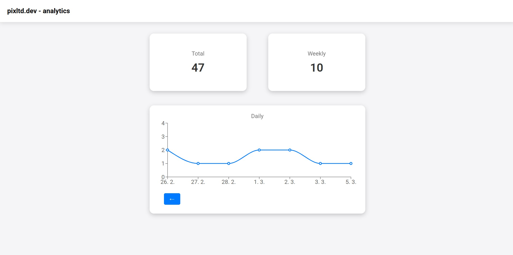

# 📊 React Analytics Dashboard

After being tired with over the top analytics solutions for my web app, I decided it's going to be fun to make light weight solution of my own, and here it is for you all to use 😊

A lightweight analytics module for tracking **unique visitors per day** in React applications. Logs visits via a **PHP backend** and displays data in a **graphic dashboard**.



## 📦 Installation

```sh
clone the repository
```

In your **React project**, link the module:

```json
"dependencies": {
  "react-lw-analytics": "file:../path-to-your-analytics-module"
}
```

Then install dependencies:

```sh
yarn install
# OR
npm install
```

## 🚀 Usage

Import and log visits:

```tsx
import { logVisit } from "react-lw-analytics";
useEffect(() => {
  logVisit();
}, []);
```

Display the dashboard:

```tsx
import AnalyticsDashboard from "react-lw-analytics";
<AnalyticsDashboard isAuthenticated={true} />;
```

## 🖥️ Backend Setup

The backend is included in the package. The only setup required is to create `analytics.json` inside the **public/backend folder** of your React project:

‼️ do not replace that file after first creating while deploying your app - it stores the data, you would lose them

```sh
public/backend/analytics.json
```

If running locally, start a PHP server in the backend folder:

```sh
cd path-to-your-cloned-repo
php -S localhost:8001
```

## 🌐 Usage in a Normal HTML Site Subfolder

If you have a plain HTML website, you can build and place analytics React app in a subfolder (e.g., `/mysite/analytics/`), and then simply include script to call the tracking function in your index.html and then look at the analytics in the react project in the subfolder.

```sh
<script>
  function logVisit() {
    fetch('mysite/analytics/backend/track.php', { method: 'POST' })
      .catch(error => console.error('Failed to log visit:', error));
  }

  // Call it on page load, for example:
  window.addEventListener('load', logVisit);
</script>
```

## 📜 License

GNU GENERAL PUBLIC LICENSE

🚀 Happy Coding!
